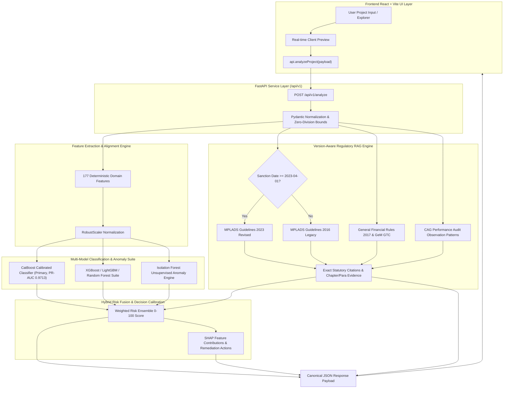

# MPLADS AI Audit — System Architecture & Integration (AGASTYA)

## 1. System Overview
AGASTYA (MPLADS AI Audit & Intelligence System) is a multi-tier governance decision-support platform designed to detect financial anomalies, procurement irregularities, progress desynchronization, contractor monopolies, and statutory non-compliance in MPLADS (Member of Parliament Local Area Development Scheme) project disbursements.

---

## 2. End-to-End Canonical Architecture Flow

---

## 3. Tier Specifications

1. **Frontend (`src/`):**
   - React 18, TypeScript, Tailwind CSS, Lucide Icons, Sonner.
   - Live validation and interactive regulatory evidence drawer in `ProjectRiskSheet.tsx`.
2. **Backend API (`backend/`):**
   - FastAPI with OpenAPI documentation, asynchronous event-driven agents, and standardized endpoints (`/api/v1/analyze`, `/api/v1/models/status`, `/api/v1/rag/status`).
3. **ML & Feature Engineering (`ml/`):**
   - 177 high-dimensional signals extracted from financial, temporal, contractor, procurement, geospatial, and document tables.
   - Calibrated CatBoost, XGBoost, LightGBM, Random Forest, and Isolation Forest.
4. **Regulatory RAG Knowledge Base (`backend/rag/` & `data/regulatory/`):**
   - Date-aware statutory retrieval dynamically citing MPLADS 2023 vs 2016 Guidelines, GFR 2017 Rule 149/144, GeM, and CAG Audit Reports.
