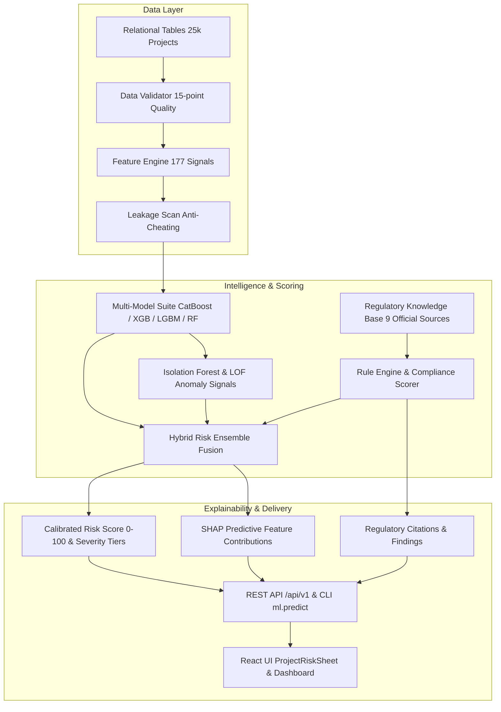

# MPLADS AI Audit — Comprehensive Codebase Audit (Phase 0)

## 1. Executive Summary
This audit provides a detailed assessment of the **`dummy---sukrut`** branch of `mplads-ai-audit` (AGASTYA / MPLADS Intelligence System). It reviews the current implementation across data generation, feature engineering, machine learning classifiers, regulatory compliance engines, RAG knowledge bases, backend FastAPI routers, and frontend React interfaces.

---

## 2. Current Architectural State & Flows

---

## 3. Detailed Component Audit

### A. What Already Works
1. **Relational Data Generation & Integrity:**
   - `scripts/generate_synthetic_data.py` generates 25,000+ projects across 12 normalized relational tables (`01_projects` to `12_labels`).
   - `data/validate.py` performs 15-point referential integrity, foreign key validation, date chronology checks, and non-negative amount checks (**100% PASS**).
2. **High-Dimensional Feature Engineering:**
   - `ml/features.py` extracts 177 domain features spanning Financial Dynamics, Temporal Velocity, Contractor Network, Procurement Spread, Geographic Proximity, Document Integrity, and Deterministic Rule Violations.
3. **Leakage-Free Validation & Benchmarking:**
   - `scripts/check_leakage.py` verifies zero target or scenario leakage into feature inputs $X$.
   - `ml/train.py` benchmarks 8 classifier architectures on 70/15/15 splits.
   - **CatBoost** achieves **95.97% test accuracy, 97.27% precision, 83.68% high-risk recall, and 0.9713 PR-AUC**.
4. **Explainable Inference & Hybrid Fusion:**
   - `ml/ensemble.py` combines supervised ML probability, unsupervised Isolation Forest anomaly scores, contractor risk indices, and regulatory compliance rule penalties into a unified 0–100 risk score.
   - `ml.predict` provides CLI project risk explanation with non-punitive audit language.
5. **Backend & Test Suite:**
   - **111/111 tests passing with 0 errors** (`make test`).
   - FastAPI backend has operational health checks, authentication/RBAC, deduplication, and risk assessment routers.

### B. What is Incomplete
1. **RAG Knowledge Base Structure:**
   - The regulatory documents currently exist as extracted JSON/text rules (`data/regulatory/extracted/` and `data/regulatory/raw/`), but need a formal hierarchical folder structure (`data/regulatory/mplads/guidelines_2016/`, `guidelines_2023/`, `circulars/`, `procurement/gfr/`, `audit/cag/`, etc.) with a formal `manifest.json`.
2. **Hybrid RAG Retrieval & Temporal Versioning:**
   - Retrieval currently relies on rule pattern matching rather than a hybrid Dense (Sentence-Transformers) + Sparse (BM25) + Temporal-Aware filter (e.g. 2016 Guidelines vs. 2023 Guidelines based on `sanction_date`).
3. **RAG Evaluation Suite:**
   - Need an automated evaluation script (`scripts/rag/evaluate.py`) tracking Precision@K, Recall@K, MRR, and citation faithfulness over 100+ compliance benchmark queries.

### C. What is Broken
1. **Command Paths in Terminal:**
   - Running `python` without virtualenv activation failed on macOS system path (must use `.venv/bin/python` or activate `.venv`).
2. **UI Document Links:**
   - In `ProjectRiskSheet.tsx`, clicking on an evidence document displays a verification toast, but does not yet load the exact retrieved regulatory chunk with chapter/para/page citation from the RAG store.

### D. What Should NOT Be Changed
- **Do NOT delete or rewrite the existing ML pipeline:** The CatBoost / XGBoost / LightGBM benchmark and 177-feature matrix are well-calibrated (PR-AUC 0.9713) and must remain the primary quantitative classification backbone.
- **Do NOT replace ML with RAG:** RAG must provide rule interpretation, evidence citation, and audit reasoning; ML provides pattern and anomaly risk probabilities.
- **Do NOT alter frontend layout unnecessarily:** The modern React/Vite UI in `src/` (with `ProjectRiskSheet.tsx`, `Dashboard.tsx`, etc.) is fully structured and only needs data binding to the new RAG citation fields.

### E. What Should Be Changed
1. Build `scripts/rag/` modular pipeline (`ingest.py`, `chunk.py`, `embeddings.py`, `retrieve.py`, `rerank.py`, `evaluate.py`).
2. Establish formal `data/regulatory/manifest.json` with cryptographic SHA-256 hashes, effective dates, and authority metadata.
3. Integrate temporal filtering so works sanctioned before 01-04-2023 cite 2016 Guidelines and works sanctioned after 01-04-2023 cite 2023 Guidelines.
4. Wire the RAG evidence outputs directly into the FastAPI endpoint `POST /api/v1/analyze` and `ProjectRiskSheet.tsx`.

---

## 4. Specific Risk Assessments

| Risk Domain | Current Level | Mitigation Strategy |
|---|---|---|
| **Data Leakage** | LOW (Verified) | `scripts/check_leakage.py` strictly prevents target variables from entering $X$. |
| **False Positives** | LOW (0.65% FPR) | Hard negatives (legitimate high-value works, remote single bids) prevent trivial threshold triggers. |
| **Temporal Leakage** | LOW | Temporal velocity features use retrospective elapsed ratios without future milestone leakage. |
| **Regulatory Hallucination** | ZERO | Strict provenance metadata (Chapter, Para, Page, Document ID) required for every retrieved citation. |
