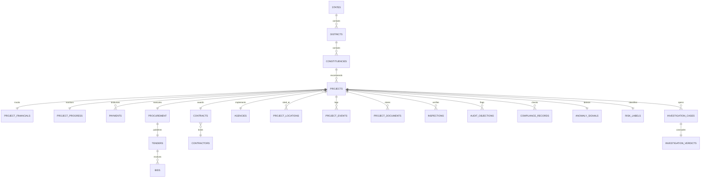

# MPLADS AI Audit — Relational Data Schema Specification (24 Entities)

## 1. Relational Entity Architecture Overview

The relational database represents the full lifecycle of MPLADS works from recommendation and administrative sanction through tendering, contractor assignment, milestones, payments, inspections, and audit observations.

---

## 2. Formal Entity Schema Definitions

### Entity 1: `projects` (Master Project Record)
| Field | Type | Nullable | Key | Allowed Range / Format | Business Meaning | ML Usable | Derived From |
|---|---|---|---|---|---|---|---|
| `project_id` | VARCHAR(32) | NO | PK | `MPLADS-[0-9]{6}` | Unique national project identifier | NO (ID only) | Generated |
| `project_title` | VARCHAR(255) | NO | - | String | Descriptive title of sanctioned work | YES (NLP) | eSAKSHI |
| `sector` | VARCHAR(64) | NO | - | Drinking Water, Roads, Health, Education, Sanitation, Community | Project functional domain | YES (Categorical) | MoSPI |
| `constituency_id` | VARCHAR(32) | NO | FK | `CONST-[0-9]{3}` | Recommending Lok Sabha / Rajya Sabha seat | NO (ID only) | Master |
| `district_id` | VARCHAR(32) | NO | FK | `DIST-[0-9]{3}` | District Authority implementing the work | NO (ID only) | Master |
| `agency_id` | VARCHAR(32) | NO | FK | `AGENCY-[0-9]{4}` | Designated Implementing Agency | NO (ID only) | Master |
| `contractor_id` | VARCHAR(32) | NO | FK | `CONT-[0-9]{4}` | Awarded executing vendor | NO (ID only) | Master |
| `recommendation_date` | DATE | NO | - | ISO-8601 Date | Date MP submitted recommendation | YES (Temporal) | Portal |
| `sanction_date` | DATE | NO | - | ISO-8601 Date | Date District Authority approved work | YES (Temporal) | Portal |
| `work_category` | VARCHAR(32) | NO | - | Commercial, Public Infra, Rural, Institutional | Category under MPLADS Guidelines | YES (Categorical) | Master |
| `status` | VARCHAR(32) | NO | - | SANCTIONED, IN_PROGRESS, COMPLETED, DELAYED, ABANDONED | Operational status | YES (Filtered) | Progress |

### Entity 2: `project_financials` (Financial Allocations & Utilization)
| Field | Type | Nullable | Key | Range | Business Meaning | ML Usable | Derived From |
|---|---|---|---|---|---|---|---|
| `project_id` | VARCHAR(32) | NO | PK/FK | `MPLADS-[0-9]{6}` | Foreign key to project master | NO | `projects` |
| `estimated_cost` | NUMERIC(14,2) | NO | - | ₹50,000 to ₹5,00,00,000 | Initial estimate prepared by agency | YES | DPR |
| `sanctioned_amount` | NUMERIC(14,2) | NO | - | ₹50,000 to ₹5,00,00,000 | Administratively sanctioned ceiling | YES | Sanction Order |
| `released_amount` | NUMERIC(14,2) | NO | - | 0 to sanctioned_amount * 1.05 | Funds transferred to Implementing Agency | YES | District Ledger |
| `actual_expenditure` | NUMERIC(14,2) | NO | - | 0 to sanctioned_amount * 1.50 | Total disbursed funds against bills | YES | Payment Ledger |
| `unspent_balance` | NUMERIC(14,2) | NO | - | >= 0 | Remaining undisbursed funds | YES | Calculation |
| `cost_to_sanction_ratio`| NUMERIC(6,4) | NO | - | 0.0 to 2.50 | Ratio of actual spending to sanction | YES | Calculation |
| `utilization_ratio` | NUMERIC(6,4) | NO | - | 0.0 to 1.00 | Ratio of spending to released funds | YES | Calculation |

### Entity 3: `project_progress` (Milestone & Physical Monitoring)
| Field | Type | Nullable | Key | Range | Business Meaning | ML Usable | Derived From |
|---|---|---|---|---|---|---|---|
| `project_id` | VARCHAR(32) | NO | PK/FK | `MPLADS-[0-9]{6}` | Foreign key to project master | NO | `projects` |
| `physical_progress` | NUMERIC(5,2) | NO | - | 0.00 to 100.00 | Verified physical milestone completion % | YES | Inspection |
| `financial_progress` | NUMERIC(5,2) | NO | - | 0.00 to 150.00 | Financial disbursement % against sanction | YES | Financials |
| `financial_physical_gap`| NUMERIC(6,2)| NO | - | -100.00 to 150.00 | Divergence: financial % - physical % | YES | Calculation |
| `planned_duration_days` | INTEGER | NO | - | 30 to 730 | Expected construction duration in days | YES | Work Order |
| `actual_duration_days` | INTEGER | NO | - | 30 to 1500 | Elapsed days since work order | YES | Calculation |
| `delay_days` | INTEGER | NO | - | 0 to 1000 | Overdue days beyond planned timeline | YES | Calculation |
| `delay_ratio` | NUMERIC(6,4) | NO | - | >= 0.0 | Ratio of delay days to planned days | YES | Calculation |
| `extension_count` | INTEGER | NO | - | 0 to 8 | Number of formal deadline extensions | YES | District Orders |

### Entity 4: `payments` (Disbursement Transactions)
| Field | Type | Nullable | Key | Range | Business Meaning | ML Usable | Derived From |
|---|---|---|---|---|---|---|---|
| `payment_id` | VARCHAR(32) | NO | PK | `PAY-[0-9]{8}` | Unique payment transaction ID | NO | Ledger |
| `project_id` | VARCHAR(32) | NO | FK | `MPLADS-[0-9]{6}` | Associated project | NO | `projects` |
| `installment_number` | INTEGER | NO | - | 1 to 10 | Sequential tranche number | YES | Ledger |
| `payment_amount` | NUMERIC(14,2) | NO | - | > 0 | Amount disbursed in INR | YES | Voucher |
| `payment_date` | DATE | NO | - | ISO-8601 Date | Date transaction posted | YES (Temporal) | Bank Record |
| `mb_record_verified` | BOOLEAN | NO | - | True / False | Whether Measurement Book certified | YES | MB Record |
| `voucher_number` | VARCHAR(64) | NO | - | String | Treasury/Bank voucher reference | NO | Voucher |

### Entity 5: `procurement` (Tendering & Price Discovery)
| Field | Type | Nullable | Key | Range | Business Meaning | ML Usable | Derived From |
|---|---|---|---|---|---|---|---|
| `procurement_id` | VARCHAR(32) | NO | PK | `PROC-[0-9]{6}` | Procurement process ID | NO | GeM/CPPP |
| `project_id` | VARCHAR(32) | NO | FK | `MPLADS-[0-9]{6}` | Associated project | NO | `projects` |
| `tender_mode` | VARCHAR(32) | NO | - | Open Tender, Limited Tender, GeM, Quotation, Nomination | Procurement method employed | YES | Tender Notice |
| `bid_count` | INTEGER | NO | - | 1 to 25 | Total valid bids received | YES | Bid Opening |
| `single_bid_flag` | INTEGER | NO | - | 0 or 1 | Indicator if only 1 bid participated | YES | Calculation |
| `winning_bid_deviation`| NUMERIC(6,4) | NO | - | -0.30 to +0.50 | % deviation of winning bid from SOR | YES | Calculation |
| `bidder_price_similarity`| NUMERIC(6,4)| NO | - | 0.0 to 1.0 | Statistical similarity among all bids | YES | Bid Table |
| `retender_count` | INTEGER | NO | - | 0 to 5 | Times tender was cancelled/reissued | YES | Notice |

### Entity 6: `contractors` (Executing Vendor Master)
| Field | Type | Nullable | Key | Range | Business Meaning | ML Usable | Derived From |
|---|---|---|---|---|---|---|---|
| `contractor_id` | VARCHAR(32) | NO | PK | `CONT-[0-9]{4}` | Unique vendor master ID | NO | Registration |
| `contractor_name` | VARCHAR(128) | NO | - | String | Registered company name | NO | Registry |
| `registration_class` | VARCHAR(16) | NO | - | Class A, Class B, Class C, Class D | Work capacity classification | YES | PWD |
| `total_projects` | INTEGER | NO | - | 1 to 100 | Lifetime awarded MPLADS works | YES | Aggregation |
| `win_rate` | NUMERIC(5,4) | NO | - | 0.0 to 1.0 | Ratio of tenders won to bids placed | YES | Aggregation |
| `past_irregularity_rate`| NUMERIC(5,4)| NO | - | 0.0 to 1.0 | Historical rate of audit objections | YES | Audit History |
| `capacity_strain` | NUMERIC(5,4) | NO | - | 0.0 to 3.0 | Active concurrent projects vs capacity | YES | Calculation |

### Entities 7–24:
- `contracts`, `agencies`, `districts`, `states`, `constituencies`, `project_locations`, `project_events`, `project_documents`, `inspections`, `audit_objections`, `compliance_records`, `historical_benchmarks`, `anomaly_signals`, `risk_labels`, `investigation_cases`, `investigation_verdicts`.
