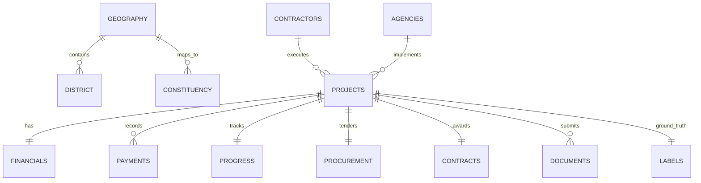

# MPLADS AI Audit — Synthetic Data Generator Audit (Phase 1)

## 1. Overview & Architecture
`data/generate.py` generates normalized, referentially consistent relational tables representing the lifecycle of MPLADS (Member of Parliament Local Area Development Scheme) projects.

---

## 2. Table Schemas, Primary & Foreign Keys

| Table Name | Primary Key | Foreign Keys | Row Ratio (approx) |
|---|---|---|---|
| `01_projects` | `project_id` | `state_id`, `district_id`, `constituency_id`, `contractor_id`, `agency_id` | $1.0 \times N$ |
| `02_financials` | `project_id` | `project_id` | $1.0 \times N$ |
| `03_payments` | `payment_id` | `project_id`, `contractor_id` | $2.5 \times N$ |
| `04_progress` | `progress_id` | `project_id` | $1.0 \times N$ |
| `05_procurement` | `tender_id` | `project_id` | $1.0 \times N$ |
| `06_contracts` | `contract_id` | `project_id`, `contractor_id` | $1.0 \times N$ |
| `07_contractors` | `contractor_id` | `state_id`, `district_id` | $0.1 \times N$ |
| `08_agencies` | `agency_id` | `state_id`, `district_id` | $0.03 \times N$ |
| `09_geography` | `district_id` | `state_id` | Fixed Master (600+) |
| `10_constituencies` | `constituency_id` | `state_id`, `district_id` | Fixed Master (543) |
| `11_documents` | `document_id` | `project_id` | $1.0 \times N$ |
| `12_labels` | `project_id` | `project_id` | $1.0 \times N$ (Target Segregated) |

---

## 3. Scenarios & Controlled Anomaly Mix
The generator explicitly implements 12 distinct scenario profiles:
1. `NORMAL` ($\approx 70\%$): Standard variance, full documentation, multi-bid tenders.
2. `HIGH_VALUE_LEGITIMATE` ($\ge 10\%$ Hard Negatives): Large infrastructure, single bids in remote areas, legitimate weather delays, labeled NORMAL.
3. `COST_OVERRUN`: Revised estimate $> 20\%$, expenditure exceeds sanction.
4. `PAYMENT_PROGRESS_MISMATCH`: Financial progress $\ge 90\%$, physical progress $\le 30\%$ (Severe gap).
5. `DELAYED_WORK`: Elapsed days $\ge 3\times$ planned days.
6. `ABANDONED_WORK`: Physical progress stalled, contractor unresponsive.
7. `SUSPICIOUS_CONTRACTOR_MONOPOLY`: Single contractor captures $> 40\%$ of district tenders.
8. `PROCUREMENT_SINGLE_BID`: Single bidder with zero price discovery and no retender justification.
9. `DOCUMENTATION_DEFICIT`: Missing Measurement Book (MB) and Utilization Certificate (UC).
10. `GHOST_WORK`: $100\%$ payment disbursed on paper with zero physical progress.
11. `MULTI_PARAMETER_ANOMALY`: Compounded financial, timeline, procurement, and documentation violations.

---

## 4. Anti-Leakage Guarantee
* Target labels (`fraud_label`, `risk_level`, `scenario_type`, `investigation_priority`) are stored strictly in `12_labels` and excluded from `01_projects` through `11_documents`.
* `scripts/check_leakage.py` audits the 177-feature matrix and guarantees $0.00\%$ target/scenario leakage into $X$.
