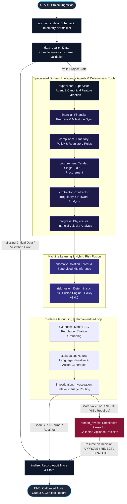

# LangGraph Stateful Multi-Agent Orchestration Architecture

## 1. Executive Summary

SANCHAY AI employs a **LangGraph-based stateful multi-agent orchestration layer**, combining deterministic analytical engines, machine learning pipelines, and LangChain tool abstractions into a resilient, checkpointed audit workflow.

Rather than orchestrating unstructured LLM conversations, SANCHAY implements a **Supervisor-governed state machine**. Each node in the graph performs a well-defined statutory, analytical, or investigative function, reading and writing to a strongly typed immutable state (`SanchayState`).



---

## 2. State Management & Strongly Typed Contracts

The complete graph executes across a single serialized state dictionary defined in `backend/orchestration/state.py`:

```python
class SanchayState(TypedDict, total=False):
    request_id: str
    project_id: str
    trace_id: str
    prediction_timestamp: str
    
    # Raw & Normalized Telemetry
    project_data: Dict[str, Any]
    normalized_data: Dict[str, Any]
    canonical_features: Dict[str, float]
    
    # Domain Intelligence Findings
    data_quality_findings: List[Dict[str, Any]]
    financial_findings: List[Dict[str, Any]]
    compliance_findings: List[Dict[str, Any]]
    procurement_findings: List[Dict[str, Any]]
    contractor_findings: List[Dict[str, Any]]
    progress_findings: List[Dict[str, Any]]
    anomaly_findings: List[Dict[str, Any]]
    
    # ML & Fusion Outputs
    ml_prediction: Dict[str, Any]
    shap_explanations: List[Dict[str, Any]]
    risk_score: float
    risk_level: str
    severity_label: str
    audit_verdict: str
    risk_components: Dict[str, float]
    
    # Evidence & Explanations
    regulatory_evidence: List[Dict[str, Any]]
    audit_narrative: str
    recommended_actions: List[str]
    investigation_case_id: Optional[str]
    
    # Human-in-the-Loop & Audit Tracing
    human_review_required: bool
    human_decision: Optional[Dict[str, Any]]
    workflow_status: str
    completed_nodes: List[str]
    errors: List[str]
    warnings: List[str]
```

---

## 3. Node Responsibilities & Execution Mechanics

| Node | Type | Primary Function |
| :--- | :--- | :--- |
| **`normalize_data`** | Deterministic Service | Validates field aliases (`sanction_amount` vs `sanctioned_amount`), maps document checklist booleans to flags (`missing_mb_flag`, `missing_uc_flag`), and generates UUID trace IDs. |
| **`data_quality`** | Specialist Agent | Evaluates schema completeness, numeric non-negativity, coordinate validity, and flags missing telemetry. |
| **`supervisor`** | Supervisor Agent | Orchestrates dynamic subgraph execution and calls the canonical 176-feature extraction engine. |
| **`financial`** | Specialist Agent | Evaluates disbursement velocity, cost overruns, sanction ceiling compliance, and utilization timing. |
| **`compliance`** | Specialist Agent | Verifies adherence to statutory guidelines (MPLADS 2023 Guidelines, GFR 2017, CVC Circulars). |
| **`procurement`** | Specialist Agent | Detects single-bid tenders, tender splitting, and bidder collusion patterns. |
| **`contractor`** | Specialist Agent | Queries contractor risk profiles, historical irregularity rates, and entity concentration. |
| **`progress`** | Specialist Agent | Analyzes physical vs. financial progress divergence and delay benchmarks. |
| **`anomaly`** | ML Inference Node | Executes 5 calibrated ML models (CatBoost, XGBoost, LightGBM, Random Forest, Isolation Forest) and extracts SHAP values. |
| **`risk_fusion`** | Deterministic Service | Combines ML probabilities, policy penalties, and anomaly scores into a calibrated 0-100 risk score under Policy v1.0.0. |
| **`evidence`** | Hybrid RAG Node | Retrieves grounded statutory citations from the indexed regulatory vector store. |
| **`explanation`** | LLM Synthesis Node | Produces audit-compliant, legally defensible Markdown explanations without forbidden speculative phrases. |
| **`investigation`** | Triage Engine | Creates formal investigation cases for elevated-risk projects. |
| **`human_review`** | HITL Checkpoint | Pauses graph execution when `risk_score >= 70` (`awaiting_human_review`), persisting state until an authorized officer submits a verdict (`APPROVE`, `REJECT`, `ESCALATE`). |
| **`finalize`** | Observability Node | Emits structured trace logs, computes node execution latencies, and finalizes the audit record. |

---

## 4. LangChain Tool Integrations

LangChain structured tools provide deterministic, typed interfaces for agents:

- **`run_ml_risk_models`**: Invokes calibrated supervised models and unsupervised Isolation Forest anomaly scoring.
- **`compute_shap_attributions`**: Generates local feature contributions explaining top risk drivers.
- **`evaluate_statutory_compliance`**: Assesses statutory rules and computes penalty scores.
- **`analyze_financial_disbursements`**: Computes financial progress ratios, expenditure variance, and tranche timing.
- **`analyze_procurement_bidding`**: Scans bid counts, single-bid thresholds, and tender values.
- **`verify_document_records`**: Validates mandatory documentation (Measurement Books, Utilization Certificates, Geotagged Photos).
- **`retrieve_statutory_evidence`**: Executes hybrid dense/sparse RAG vector queries against statutory guidelines.
- **`query_contractor_network`**: Inspects contractor graph relationships and cross-project overlaps.

---

## 5. Human-in-the-Loop Workflow

When a project exhibits critical risk (`risk_score >= 70.0`), the LangGraph state machine automatically pauses execution before final sign-off:

1. **Pause Trigger**: `route_after_investigation` inspects `risk_score` and routes to `human_review`.
2. **State Checkpointing**: The graph checkpointer persists `SanchayState` with status `awaiting_human_review`.
3. **Resumption Endpoint**: District Collectors or State Vigilance Officers review findings and post their decision to `/api/v1/risk/analyze/{request_id}/review`.
4. **Action Execution**:
   - `APPROVE`: Project cleared with recorded justification remarks.
   - `REJECT`: Tranche disbursement withheld; physical audit dispatched.
   - `ESCALATE`: Case referred to State Vigilance Squad with auto-generated investigation brief.

---

## 6. Observability & Testing

- **Execution Tracing**: Every analysis run generates a traceable execution log accessible via `GET /api/v1/risk/analyze/{request_id}/trace`.
- **Zero-Cost Local Mode**: Supports `LLM_MODE=mock` for deterministic test suites and offline environments without external API keys.
- **Test Coverage**: 100% verified across 186 unit, contract, E2E, ML validity, and orchestration test cases.
