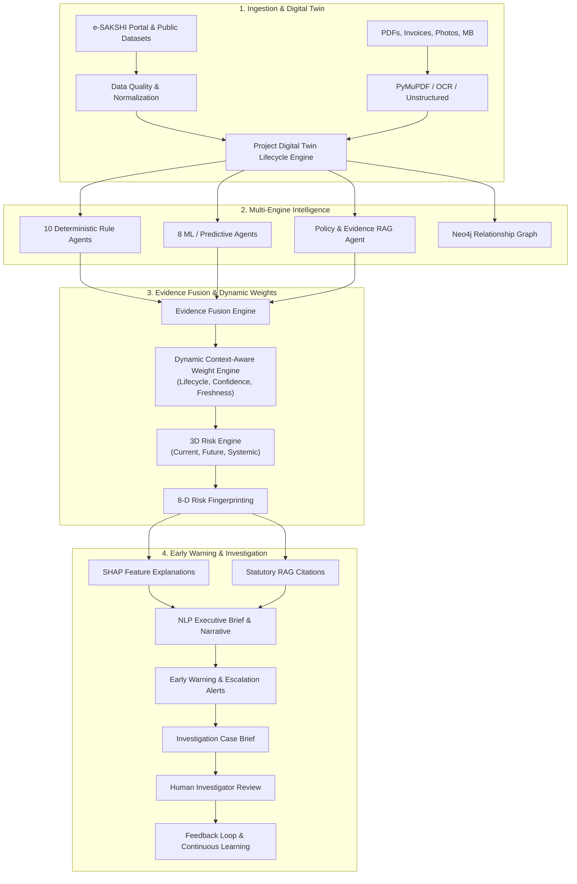

# MPLADS GUARDIAN / AGASTYA: Comprehensive Architecture & Intelligence Blueprint

## 1. Core Vision & Operational Flow
MPLADS GUARDIAN is an AI-powered Government Risk Intelligence, Early Warning, and Investigation Platform.

$$\text{DATA} \longrightarrow \text{DIGITAL TWIN} \longrightarrow \text{INTELLIGENCE} \longrightarrow \text{RISK} \longrightarrow \text{EVIDENCE} \longrightarrow \text{EARLY WARNING} \longrightarrow \text{CASE} \longrightarrow \text{HUMAN DECISION} \longrightarrow \text{CONTINUOUS LEARNING}$$

---

## 2. Project Digital Twin Lifecycle Engine
A project is represented as an evolving **Project Digital Twin** encompassing 20+ lifecycle domains:
* **Administrative Baseline:** Recommendation, Administrative Sanction, Technical Sanction, Approved Budget, Cost Estimates.
* **Geospatial & Demographics:** State, District, Constituency, GPS Latitude/Longitude, Ward, Demographics.
* **Entities:** Implementing Agency, Assigned Contractor, Participating Bidders.
* **Tender & Contracts:** Procurement Method, Tender Type, Bid Count, Work Order, Award Date.
* **Financial Stream:** Sanctioned Amount, Released Funds, Actual Expenditure, Payment Tranches, Invoices, Utilization Certificates.
* **Physical Stream:** Physical Progress %, Inspection Reports, Measurement Book (MB), Geo-Tagged Photos, Completion Certificate.
* **Intelligence State:** Applicable Policy Version, 19 Agent Evidences, Risk Trajectory History, Open Investigation Cases, Human Verdicts.

---

## 3. The 19 Specialized Intelligence Agents

| Category | # | Agent Name | Primary Function / Scope |
|---|---|---|---|
| **Deterministic** | 01 | `DataQualityAgent` | Missing fields, broken relationships, impossible dates, schema validation. |
| | 02 | `EligibilityAgent` | Prohibited items under MPLADS guidelines, non-permissible works. |
| | 03 | `BudgetAgent` | Cost-to-sanction ratio, expenditure vs. release, budget capping. |
| | 04 | `DeadlineAgent` | 1-year sanction-to-completion statutory timeline, delay tracking. |
| | 05 | `DocumentationAgent` | DPR, AS, TS, WO, MB, UC, and Completion Certificate checklist. |
| | 06 | `ProcurementAgent` | Single-bid tenders, GFR Rule 149/144 compliance, price deviation. |
| | 07 | `PaymentAgent` | Tranche sequencing, round-number payments, velocity spikes. |
| | 08 | `FinancialProgressAgent` | Utilization ratio, spending acceleration, year-end rush detection. |
| | 09 | `PhysicalProgressAgent` | Financial-vs-Physical progress gap (e.g. 90% paid vs 20% physical). |
| | 10 | `AssetCompletionAgent` | Asset handover, public utility verification, GIS registration. |
| **ML / Predictive** | 11 | `CostIntelligenceAgent` | Peer project cost benchmarks, regional cost inflation deviations. |
| | 12 | `AnomalyAgent` | Isolation Forest & Autoencoder unsupervised anomaly score. |
| | 13 | `DuplicateGhostWorkAgent` | Semantic description similarity + geo-distance proximity clustering. |
| | 14 | `DelayPredictionAgent` | Predictive ML modeling of future milestone and deadline misses. |
| | 15 | `ContractorIntelligenceAgent` | Local agency concentration, repeat win rates, irregularity rate. |
| | 16 | `GeographicIntelligenceAgent` | Geographic clustering, spatial dispersion, remote work flags. |
| | 17 | `TrendBenchmarkAgent` | District-level and sector-level historical trend deviations. |
| | 18 | `FraudArchetypeAgent` | Pattern matching against 12 known fraud archetypes. |
| **RAG / Policy** | 19 | `PolicyEvidenceAgent` | Temporal statutory retrieval with Chapter, Section, Paragraph, and Page citations. |

---

## 4. Multi-Dimensional Risk Architecture (3D Risk)

Instead of a single monolithic score, the platform computes three distinct, orthogonal risk vectors:

1. **Current Operational Risk (0–100):** Immediate observed compliance and progress deviations (payment gaps, unverified disbursements, cost overruns).
2. **Future Trajectory Risk (0–100):** Forward-looking ML predictions (probability of completion failure, expected delay in days, cost escalation).
3. **Systemic Network Risk (0–100):** Institutional and structural risk (contractor monopoly in district, agency irregularity concentration, repeated cluster patterns).

$$\text{Final Risk} = \sum_{i=1}^{19} w_i \times \text{AgentScore}_i \quad \text{where} \quad w_i = \frac{\text{AdjustedWeight}_i}{\sum \text{AdjustedWeight}}$$

$$\text{AdjustedWeight}_i = \text{BaseWeight}_i \times \text{Confidence}_i \times \text{Applicability}_i \times \text{Freshness}_i \times \text{ContextRelevance}_i$$

---

## 5. 8-Dimensional Risk Fingerprinting
Identifies the specific risk topology of each project:
1. `Cost Inflation`
2. `Payment-Progress Mismatch`
3. `Repeated Delay`
4. `Contractor Pattern`
5. `Documentation Gap`
6. `Duplicate Work Risk`
7. `Procurement Irregularity`
8. `Geographic Cluster Risk`

---

## 6. Investigation & Human-in-the-Loop Feedback Loop
* **Early Warning Alerts:** Triggered autonomously when risk escalation thresholds or trajectory slopes are breached.
* **Investigation Case Brief:** Bundles project digital twin metadata, 3D risk scores, 19 agent findings, SHAP waterfall contributions, and statutory RAG citations.
* **Human Investigator Verdicts:** Officers record one of five standardized decisions:
  * `CONFIRMED_ISSUE`
  * `FALSE_POSITIVE`
  * `INSUFFICIENT_EVIDENCE`
  * `ESCALATE`
  * `NO_ACTION_REQUIRED`
* **Continuous Learning:** Investigator feedback updates calibration weights and feeds into retraining matrices.
